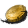
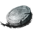
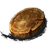

<p align="center">
  
</p>

<h1 align="center">Tyria Ledger</h1>

<p align="center">
  Guild Wars 2 Trading Post prices, vault appraisal, and a desktop overlay.<br />
  <strong>You do not need npm.</strong> Download the zip. Double-click the exe.
</p>

<p align="center">
  <a href="https://github.com/NolvusMadeIt/tpledger/releases/latest"></a>
</p>

<p align="center">
  
</p>

---

## Launch it (this is the app)

1. Open **[Releases](https://github.com/NolvusMadeIt/tpledger/releases/latest)**.
2. Download `TyriaLedger-win64.zip` — **not** the green “Code → Download ZIP” button. That one is source, not the app.
3. Unzip the folder anywhere you want.
4. Double-click **`Tyria Ledger.exe`**.

That’s it. No install wizard. No `npm`. No terminal.

Windows SmartScreen may say **Unknown publisher**. **More info → Run anyway.** It is unsigned, not a virus. Notes: [`desktop/SIGNING.md`](desktop/SIGNING.md).

### First run

1. Open **Vault**.
2. Paste a GW2 API key and give it a name.
3. **Save & load**.

Create a key at [account.arena.net](https://account.arena.net/applications) with:

- `account`
- `inventories`
- `characters` (bags on each toon)

The key is encrypted on this PC and never shown again.

### Overlay

| | |
| --- | --- |
| Hotkey | `Control+Shift+L` (change in Settings) |
| Dock | Left or right |
| Minimize | Dash — hides next to the clock |
| Close | Quits |

---

## What it does

| | |
| --- | --- |
| **Price Check** | Name, item id, or an in-game copy like `[4 Heads of Cabbage]` / `[&AgGNhQAA]`. Live buy, sell, tax. |
| **Vault** | Bank, mats, shared, character bags. Bound items stay off the list. Bags start collapsed. |
| **Fence** | What to list, where the stack lives, which character has more. |
| **Stars** | Favorites. Totals only those. |
| **Plugins** | Drop a folder in `plugins/` beside the exe. |

<p align="center">
  
  
  
</p>

### Price check

Paste `[4 Heads of Cabbage]` — brackets and counts are stripped. Chat codes and `#id` in the tooltip copy on click. Empty search shows a short market pulse.

### Vault

Bank / Mats / Shared / each character are accordions, **collapsed by default**. Settings → **Expand vault bags** if you want them open. Fence shows which bag and which character holds a stack.

### Updates

Settings → pick a version → pick a folder → **Close and install**. A progress window shows Download → Unpack → Restart.

---

## Plugins

Next to the exe:

```
Tyria Ledger.exe
plugins/
  my-plugin/
    plugin.json
    index.js
```

Or drop the folder onto **Settings**. Bundled: **Flip Watch**, **Chat Copy**. Details: [`public/plugins/README.md`](public/plugins/README.md).

---

## For developers only

This repo is the source. If you cloned it, you still launch the **release exe** to use the app. `npm run dev` is the live web preview while you change code.

```bash
git clone https://github.com/NolvusMadeIt/tpledger.git
cd tpledger
npm install
npm run dev          # web preview
node desktop/pack-win.mjs   # rebuild the Windows zip
```

Output: `apps/Tyria Ledger-win32-x64/Tyria Ledger.exe`.

---

## Privacy

- API keys never leave the device except to talk to `api.guildwars2.com`.
- Account-bound items are not listed as TP stock.
- No telemetry.

---

<p align="center">
  
</p>
